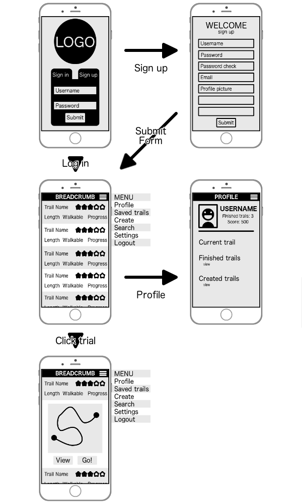

# Breadcrumb

### About Breadcrumb

#### Breadcrumb aims to take users on literal journeys, created by other users, through their city.

Each trail will have multiple stop points for travelers to experience. The user will receive hints at each stop of the trail, providing them with some sort of puzzle/challenge to complete in the area. Challenges may utilize text, photos, videos, audio, or augmented reality. Upon completing each challenge users will have the opportunity to leave a comment/photo for that step of the trail. Users will gain points based on how well the fair on a trail, and can rate and review other users' trails when they finish.

----------

## The team ##

- **Product owner**: [Eric Periou](https://github.com/eperiou/)
- **Scrum Master**: [Olivia Sabo-Rush](https://github.com/livrush/)
- **Development team**:
  - [Devin Fields](https://github.com/defields923/)
  - [Alice Lai](https://github.com/aplai168/)

----------

## Wireframe

